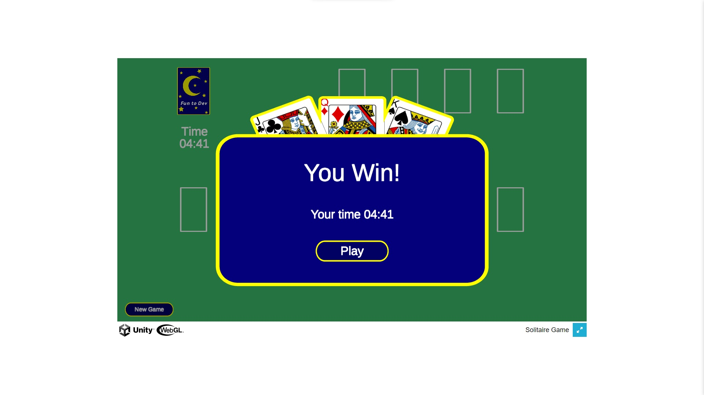

# SOLITAIRE GAME
Solitaire, also known as Klondike or Patience, is a classic card game that has been a popular pastime for generations. This single-player game is known for its simplicity and addictive nature, making it a favorite for those looking to pass the time or challenge their strategic thinking.

The objective of Solitaire is to move all the cards from a shuffled deck into four foundation piles, one for each suit (hearts, diamonds, clubs, and spades). The cards must be arranged in ascending order, starting with the Ace and ending with the King.

The game begins with seven tableau piles, which are initially dealt with a varying number of face-down and face-up cards. Players can move cards between tableau piles, either building them in descending numerical order and alternating colors, or by transferring a sequence of cards to an open foundation pile. Empty tableau slots can be filled with a King or any valid sequence of cards.

Solitaire is a game of strategy, requiring careful planning and decision-making. Success in Solitaire depends on your ability to create sequences, uncover hidden cards, and ultimately, move all the cards to the foundation piles. The game is won when all four foundation piles are complete, with each suit's cards arranged in ascending order.

Whether you're a casual player or a Solitaire enthusiast, this timeless game offers hours of entertainment and a satisfying sense of accomplishment when you successfully solve the puzzle. Solitaire is available on a variety of platforms, from physical card decks to computer and mobile applications, making it accessible to players of all ages and skill levels.

## LINK DEMO
<div align='center'>

[Click vào đây để chơi game](https://tynab.github.io/Solitaire-Game)

</div>

## IMAGE DEMO
<p align='center'>
</img>
</p>

## CODE DEMO
```c#
public bool StackAble(GameObject selected)
{
    var s1 = Slot.GetComponent<Selectable>();
    var s2 = selected.GetComponent<Selectable>();

    return !s2.IsDeckPile && (s2.Top ? (s1.Suit == s2.Suit || s1.Values is 1 && s2.Suit is null) && s1.Values == s2.Values + 1 : s1.Values == s2.Values - 1 && s1.Suit is not "C" and not "S" != s2.Suit is not "C" and not "S");
}
```
